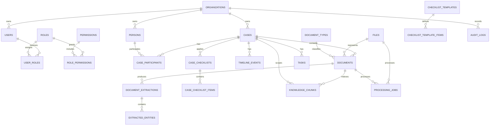

# LEX OS initial data model

**Status:** Schema implemented in Delivery 3; application behavior implemented through Delivery 8
**Last updated:** 2026-08-06

## Modeling principles

- PostgreSQL is the system of record; Prisma is the primary data access layer.
- Every tenant-owned row carries `organization_id`.
- Primary keys are UUIDs generated by PostgreSQL (`gen_random_uuid()`).
- Mutable records have `created_at` and `updated_at`; immutable history/audit records have `created_at` only.
- Database names use English `snake_case`; Prisma models use `PascalCase` and fields use `camelCase`.
- Legal-domain values may use stable Portuguese codes.
- Files and semantic documents are separate concepts.
- AI outputs are append-only and preserve execution/provenance metadata.
- Soft deletion is used for user-facing master records where recovery/audit is valuable; join/history records are not silently soft-deleted.
- Tenant consistency is enforced in services and, wherever possible, with composite database foreign keys.

## MVP aggregate map

The diagram omits several user links and nullable/global ownership links for readability. The Prisma proposal is the detailed reference.

## Initial entities

| Entity                     | Tenant ownership | Lifecycle                          | Purpose                                                       |
| -------------------------- | ---------------- | ---------------------------------- | ------------------------------------------------------------- |
| `organizations`            | Root tenant      | Soft-deletable                     | Legal/customer organization and settings                      |
| `users`                    | Required         | Soft-deletable                     | Authenticated organization member                             |
| `roles`                    | Global or tenant | Mutable                            | Permission bundle; global roles seed defaults                 |
| `permissions`              | Global           | Mutable catalog                    | Stable authorization capability codes                         |
| `user_roles`               | Via user         | Join                               | Assign global/visible tenant roles to users                   |
| `role_permissions`         | Via role         | Join                               | Compose role bundles from granular permissions                |
| `persons`                  | Required         | Soft-deletable                     | Individual, company, or government party/contact              |
| `cases`                    | Required         | Soft-deletable                     | Internal legal matter, independent of court proceedings       |
| `case_participants`        | Required         | Mutable                            | Person's role and side in one case                            |
| `files`                    | Required         | Soft-deletable                     | Physical object metadata, checksum, quarantine and scan state |
| `documents`                | Required         | Soft-deletable                     | Semantic meaning of a file, optional case/type classification |
| `document_types`           | Global or tenant | Mutable                            | Version-independent document taxonomy                         |
| `document_extractions`     | Required         | Append-only                        | One provider execution/output for a document                  |
| `extracted_entities`       | Required         | Append-only                        | Located entity produced by one extraction                     |
| `timeline_events`          | Required         | Mutable review state               | Sourced event proposal and human confirmation                 |
| `checklist_templates`      | Global or tenant | Versioned/mutable activation       | Checklist definition for legal area/type                      |
| `checklist_template_items` | Global or tenant | Definition                         | Ordered requirement in a template version                     |
| `case_checklists`          | Required         | Mutable                            | Snapshot/application of a template to a case                  |
| `case_checklist_items`     | Required         | Mutable review state               | Case-specific requirement and linked document                 |
| `tasks`                    | Required         | Soft-deletable                     | Manual or traceably generated pending work                    |
| `knowledge_chunks`         | Required         | Regenerable, provenance-preserving | Searchable chunk and optional embedding                       |
| `processing_jobs`          | Required         | Mutable state/history retained     | Product-visible async processing lifecycle                    |
| `audit_logs`               | Required         | Append-only                        | Safe record of material user/system/AI activity               |

Secondary entities such as lawsuits, versions, media transcriptions, conversations, evidence, notes, knowledge items, and precedents are intentionally deferred until the base vertical flow works. Their absence from the first migration is deliberate, not a rejection of the product model.

## Core identity and access constraints

### Organizations

`organizations` stores legal/trade names, normalized document number, subscription-plan code, status, settings, and soft-deletion timestamps. Sensitive or high-cardinality configuration should not be placed indiscriminately in `settings`.

### Users

- Unique `(organization_id, email)` after normalized lowercase/trim processing.
- Passwords use Argon2id hashes only.
- Refresh sessions use a separate `refresh_sessions` support table with tenant-consistent user linkage, token-family tracking, hashed token identifiers, expiry, and rotation/revocation timestamps.
- Soft deletion does not automatically release an e-mail identity in the baseline; reactivation is preferred. Changing this requires an explicit partial-index migration.
- `last_login_at` updates only after successful authentication.

### Roles and permissions

Roles may be global (`organization_id IS NULL`) or tenant-specific. PostgreSQL partial unique indexes enforce one global `code` and one code per organization because a normal unique constraint does not consider `NULL` values equal.

A tenant user may receive:

- a global system role; or
- a role whose `organization_id` equals the user's organization.

That visibility rule cannot be fully expressed by an ordinary foreign key because of nullable global ownership, so application checks and integration tests are mandatory. Permission codes are globally unique and stable.

## Tenant-consistent relationships

Tenant-owned parents expose a unique `(organization_id, id)` pair. Children that carry both values reference that pair, preventing accidental relations such as a participant from organization A pointing to a case from organization B.

This pattern applies to:

- case → responsible user;
- participant → case and person;
- file → uploader and optional duplicate source;
- document → case, file, parent document, and human classifier;
- extraction/entity → document/extraction/person;
- timeline → case, confirmer, and optional extraction;
- case checklist/item → case/checklist/document/user;
- task → case/assignee/creator;
- chunk → case/document;
- processing job → case/file/document;
- audit → optional user.

Global-or-tenant definitions (`roles`, `document_types`, and checklist templates) need service-level visibility checks because `organization_id` can be null.

## Files and duplicate semantics

A `files` row represents an upload attempt and its logical physical object. It includes:

- provider, bucket, and unpredictable object key;
- original display filename, detected MIME, extension, and size;
- SHA-256 checksum;
- uploader and source;
- validation, virus scan, and lifecycle status;
- optional `duplicate_of_file_id` pointing to an earlier same-tenant file.

The partial lookup index `(organization_id, checksum_sha256, size_bytes)` covers active `AVAILABLE/CLEAN` rows and is intentionally not unique. A transaction-scoped advisory lock serializes concurrent lookup/creation for one tenant and checksum. A second upload is recorded and audited; Delivery 6 retains its second object until a retention/legal-hold policy authorizes a different decision. The duplicate relation makes the result explicit and avoids cross-tenant deduplication leakage.

Object existence is not represented by a PostgreSQL binary column. Delivery 6 reconciliation reports active file rows with missing objects, stale quarantine, and unreferenced objects without deleting automatically.

## Documents and classification

A file answers “what bytes were received?”; a document answers “what legal/business document do those bytes represent?”. This allows later file versions or derived renditions without conflating physical and semantic concerns.

`documents` includes optional case and type links, human-editable title/metadata, machine classification/processing states, confidence, legibility, signature/original/duplicate indicators, and optional parent relation. Human correction records `classified_by`/`classified_at` and audit without overwriting extraction history.

Document-type codes may be global or tenant-specific. Partial unique indexes enforce visibility-scope uniqueness.

The local seed begins with this global catalog: `RG`, `CPF`, `CNH`, `CTPS`, `COMPROVANTE_RESIDENCIA`, `CONTRATO`, `PROCURACAO`, `PETICAO_INICIAL`, `CONTESTACAO`, `SENTENCA`, `ACORDAO`, `EXTRATO_BANCARIO`, `NOTA_FISCAL`, `LAUDO_MEDICO`, `BOLETIM_OCORRENCIA`, `CONVERSA_WHATSAPP`, `EMAIL`, `AUDIO`, `VIDEO`, `FOTO`, and `OUTRO`. Codes are stable identifiers; pt-BR names/descriptions are display data.

## Immutable extraction and entity history

Every `document_extractions` row represents one execution. Reprocessing appends another row. Required provenance fields are:

- `extraction_type`;
- provider, model name, optional model version;
- optional prompt version;
- provider-independent execution ID;
- status and safe error code;
- raw text and/or validated structured data;
- confidence and processing duration;
- creation time.

Raw vendor payloads should not be persisted by default; validated normalized output belongs in `structured_data`, and a safe storage artifact may hold diagnostic payloads only when governance permits.

`extracted_entities` links to both the document and extraction, includes normalized and original values, page and offset location, confidence, optional person link, and metadata. A composite relationship guarantees that the extraction belongs to the same document and organization.

## Timeline provenance and confirmation

An event includes its case, type, title/description, occurrence and date precision, importance, confidence, and a source locator. For AI output:

- `created_by_actor_type = AI`;
- `source_type`, `source_id`, and a locator such as page/segment are mandatory at the application boundary;
- `extraction_id` links the generation execution when available;
- `confirmed_by_user` starts false;
- human confirmation records `confirmed_by` and `confirmed_at` in one audited transaction.

Confirmation never changes the original extraction or actor attribution. If a human edits the event content, audit preserves the before/after safe fields.

Delivery 8 adds a composite document source relationship on `(organization_id, case_id, source_id)` and an extraction relationship on `(organization_id, source_id, extraction_id)`. PostgreSQL also rejects an `AI` event without a document source, structured locator, and generation extraction. These checks complement provider-output validation; they do not replace resource authorization.

## Checklists

A template is versioned. Editing a used template should create a new version instead of mutating historical meaning. `case_checklists` record which template version was applied. Case items copy the relevant title/description/requirement snapshot so historical checklists remain understandable even if a template is later deactivated.

Global templates and organization templates follow the same visibility rule as document types. A linked document must belong to the same organization and, under the initial policy, to the same case unless an explicit cross-case reuse policy is later accepted.

Delivery 8 persists the case ID on each checklist item and uses composite checklist/document foreign keys, so an item cannot be moved across a tenant or case accidentally. Human-reviewed statuses record the validating user and time together. Template deactivation does not delete the applied checklist or its copied item fields.

## Tasks and generated sources

Tasks support nullable case scope and human assignment. `source_type` and `source_id` identify `USER`, `AI_CHECKLIST`, `AI_DOCUMENT_ANALYSIS`, `COURT_MOVEMENT`, or `WORKFLOW`. Only the first three are relevant to the MVP; the presence of `COURT_MOVEMENT` is not authorization to build a connector.

Source ID is polymorphic and therefore not enforced by a simple foreign key. Creation services validate the source and tenant, and tests cover it. Automated tasks retain the originating processing/extraction metadata through source linkage and audit.

For `AI_CHECKLIST`, Delivery 8 adds a tenant/source partial unique index for non-deleted tasks. This makes repeated requests fail consistently instead of creating multiple active tasks for one selected checklist item.

## Knowledge chunks and vectors

A chunk contains:

- tenant and optional case/document scope;
- source type and source ID;
- deterministic index and content hash;
- normalized content;
- page/segment locator metadata;
- embedding provider, model, version, and dimensions;
- optional `vector` value;
- creation time.

Unique `(organization_id, source_type, source_id, chunk_index, content_hash)` makes chunking idempotent. Search always applies organization and authorization filters before results leave the database adapter.

The proposal uses Prisma `Unsupported("vector")` and a reviewed SQL migration for the pgvector extension. An unbounded vector column avoids embedding dimension in the domain. It also prevents an efficient approximate-nearest-neighbor index across mixed dimensions, so the MVP uses exact search on a small corpus or no vector index until a configured production embedding dimension is selected. A future migration may separate embeddings by model/dimension.

Full-text search uses a PostgreSQL generated `tsvector` column or expression index created in SQL because Prisma does not model it fully. The canonical content remains `knowledge_chunks.content`.

## Processing jobs

`processing_jobs` is the user-visible processing source of truth. It stores tenant/resource links, job type, state, priority, attempt count, provider/model, safe input/output metadata, error code/message, execution timestamps, and optimistic `version`.

The application owns allowed transitions. Redis/BullMQ data may expire without erasing the historical job record. Error messages are sanitized and must not contain document text, tokens, bucket URLs, or raw vendor responses.

Delivery 7 constrains lifecycle/error consistency in PostgreSQL and updates jobs with tenant, expected state, and optimistic version predicates. Queue messages contain no resource metadata. Each completed stage may create one deterministic child job; OCR/classification/entity executions append immutable extraction rows, and entity rows commit in one batch with their owning extraction.

Delivery 8 extends the graph with timeline and checklist jobs. Each stage appends its own immutable extraction; timeline events reference the timeline execution, while its structured provenance identifies the source text extraction. Checklist analysis creates or reuses the case/template-version snapshot and never resets a human-reviewed item to an AI proposal.

## Audit logs

Audit rows are append-only and tenant-scoped. `old_data` and `new_data` are produced through action-specific allowlists, not by serializing an arbitrary database object. IP addresses and user agents are treated as personal data and retained only according to policy.

The actor may be a user, system process, AI execution, or integration. `actor_id`, `request_id`, `correlation_id`, and optional `processing_job_id` provide traceability without putting sensitive content in logs.

## Index strategy

The initial migrations should include:

- unique user e-mail per organization;
- unique case internal code per organization;
- scoped role and document-type partial unique indexes;
- tenant-first indexes for every common list and foreign-key path;
- file checksum/size lookup per organization;
- jobs by tenant/status/created time and status/created time for workers/reconciliation;
- documents by tenant/case/processing status;
- extractions by tenant/document/type/creation time;
- timeline by tenant/case/occurred time;
- checklist and tasks by tenant/case/status;
- chunks by tenant/case/document/source;
- audit by tenant/creation time and tenant/entity/id;
- PostgreSQL full-text index via reviewed SQL;
- no ANN vector index until one compatible dimension strategy is accepted.

Index selection must be verified with representative synthetic query plans; tenant-first does not mean one wide index for every possible filter.

## Deletion and retention

Soft deletion hides user-facing master records from normal queries but does not remove objects, audit, or immutable extraction history. Authorization remains necessary to retrieve deleted data through administrative flows.

Production retention, legal holds, data subject requests, backups, and cryptographic deletion are unresolved governance requirements. Until approved, the system must not implement automatic irreversible purging. Development fixtures may be reset only through explicit local commands.

## Schema proposal and migration notes

The original reviewed proposal is retained in [`prisma-schema-proposal.md`](./prisma-schema-proposal.md), and the canonical executable schema is [`packages/database/prisma/schema.prisma`](../../packages/database/prisma/schema.prisma). The initial migration implements the PostgreSQL features that require raw SQL:

- `CREATE EXTENSION IF NOT EXISTS pgcrypto`;
- `CREATE EXTENSION IF NOT EXISTS vector`;
- partial unique indexes for nullable organization ownership;
- optional generated `tsvector`/GIN index;
- vector type/index decisions;
- checks such as confirmation-field consistency and non-negative sizes/durations.

The schema and reviewed SQL migration were implemented and validated in Delivery 3. The migration review is recorded in [`database-migrations.md`](./database-migrations.md).

## Deferred data-model decisions

Before affected implementation, confirm:

1. whether organization document numbers must be unique globally and how branch offices are represented;
2. exact confidentiality levels and case-team membership semantics;
3. CPF/CNPJ encryption/tokenization and authorized display policy;
4. production embedding model/dimension and migration behavior;
5. retention, legal hold, and hard-deletion requirements;
6. per-file, per-request, and expanded-archive limits;
7. whether duplicate physical bytes are retained or referenced after quarantine.

None blocks documentation or monorepo bootstrap. Items 1, 3, and 4 block a production-ready authentication/case release; items 5 and 7–8 block their respective search/upload release.
