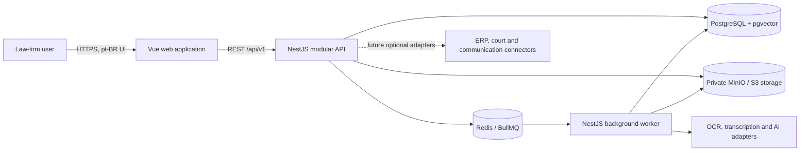
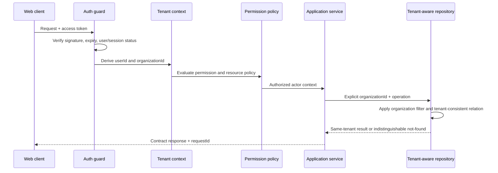
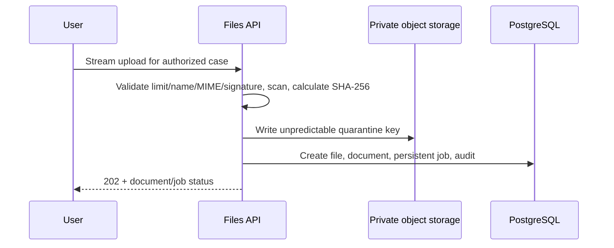
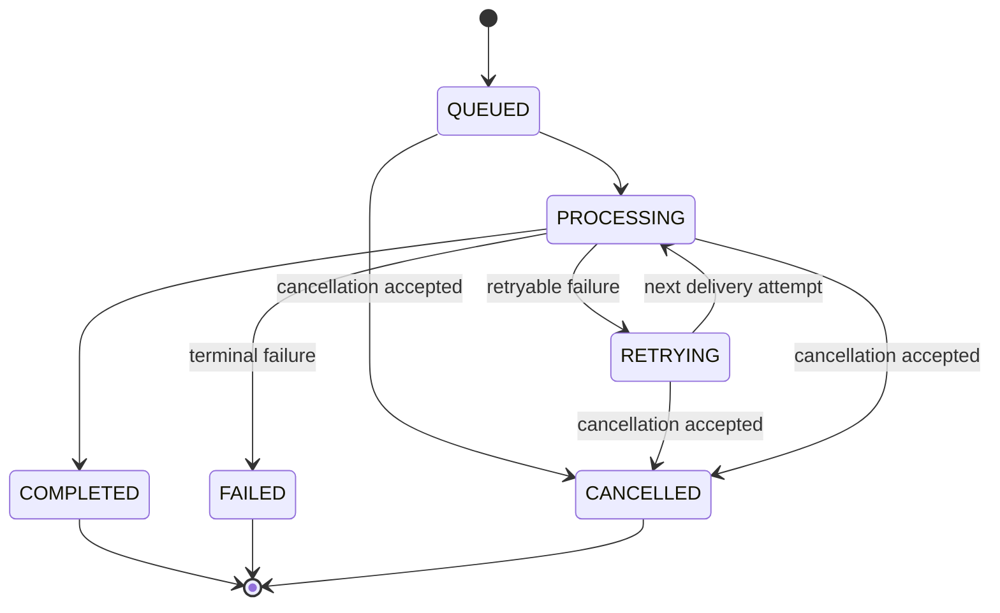

# LEX OS system overview

**Status:** Architecture implemented through Delivery 8
**Last updated:** 2026-08-06

## Architectural goals

The initial architecture optimizes for:

- strict organization isolation;
- evidence-level provenance and human review;
- reliable asynchronous file processing;
- provider independence for AI and infrastructure services;
- a small operational footprint that can evolve without premature distribution;
- testability with deterministic local dependencies and mock providers.

## System context



The API and worker are two processes of one modular backend, not independent microservices. They use the same application contracts and database. A queue keeps retryable or expensive work outside request latency.

The implemented runtime topology, ports, health semantics, and local credential rules are documented in [Local development topology](./local-development.md). Executable contracts are documented in [Authentication and HTTP contract](../api/authentication.md), [People, cases, and participants API](../api/people-cases-participants.md), [Files and documents API](../api/files-documents.md), [Processing API](../api/processing.md), and [Timeline, checklist, and tasks API](../api/timeline-checklists-tasks.md).

## Target monorepo

```text
apps/
  api/                         HTTP composition root and NestJS modules
  web/                         Vue 3, Vite, Pinia, Router, Tailwind
  worker/                      BullMQ composition root and processors
packages/
  ai-prompts/                  Versioned prompt definitions and schemas
  config/                      Typed, validated environment configuration
  contracts/                   Versioned HTTP and queue payload contracts
  database/                    Prisma client, schema, migrations, seed
  shared/                      Framework-neutral errors, IDs, result types
  eslint-config/               Shared lint rules
  tsconfig/                    Shared TypeScript configurations
infra/
  docker/                      Images and service configuration
  migrations/                  Reviewed extension/operational SQL if needed
  scripts/                     Local bootstrap and operational checks
docs/
  api/                         Generated or curated API guidance
  architecture/               System and data design
  decisions/                  Architecture Decision Records
  product/                    Product intent and scope
```

Only directories required by the active delivery should be materialized.

## Backend shape

The modular monolith contains these logical modules:

| Module                | Responsibility                                                                               |
| --------------------- | -------------------------------------------------------------------------------------------- |
| `AuthModule`          | Credentials, access tokens, refresh sessions, logout, recovery preparation, login audit      |
| `OrganizationsModule` | Current organization and tenant settings                                                     |
| `UsersModule`         | Tenant users, status, invitations/provisioning preparation                                   |
| `AccessControlModule` | Roles, permissions, policy evaluation                                                        |
| `PersonsModule`       | Individuals, companies, government entities, identifier normalization                        |
| `CasesModule`         | Internal legal matters, confidentiality and responsibility                                   |
| `ParticipantsModule`  | Person-to-case legal roles and sides                                                         |
| `FilesModule`         | Upload, validation metadata, object storage, hash, duplicate linkage, download authorization |
| `DocumentsModule`     | Semantic documents, versions/future version preparation, metadata and human correction       |
| `DocumentTypesModule` | Global and organization-specific document taxonomy                                           |
| `ProcessingModule`    | Persistent jobs, state transitions, retries, progress, queue dispatch                        |
| `ExtractionsModule`   | Immutable OCR/classification/extraction output                                               |
| `EntitiesModule`      | Extracted entities, normalization, source locations, optional person linkage                 |
| `TimelineModule`      | Sourced preliminary events and human confirmation                                            |
| `ChecklistModule`     | Versioned templates and per-case item status                                                 |
| `TasksModule`         | Manual and traceably generated pending work                                                  |
| `KnowledgeModule`     | Source-aware text normalization, chunks, embeddings, institutional memory                    |
| `SearchModule`        | Tenant-scoped structured, full-text, and semantic retrieval                                  |
| `AuditModule`         | Append-only safe audit events                                                                |
| `HealthModule`        | Liveness, readiness, dependency health                                                       |

Modules expose application services or explicit ports. Controllers do not call Prisma or vendor clients directly. A module does not import another module's internal repository.

### Internal layers

The code should remain pragmatic rather than ceremony-heavy:

```text
transport (HTTP / queue processor)
          ↓
application service (use case, permission, transaction boundary)
          ↓
domain policy / provider port
          ↓
infrastructure adapter (Prisma, BullMQ, S3, vendor SDK)
```

Simple CRUD may combine application and domain logic in a clear service. The important boundary is that external frameworks and vendors do not define domain behavior.

## Authentication, tenant, and authorization flow



The access token identifies the user, organization, and session, but database state remains authoritative for blocked/revoked access where required. The API never trusts tenant identity from a path, query, form, or JSON body.

This flow is implemented for authentication, current organization, people, cases, participants, files, documents, processing jobs, extraction history, timeline events, checklists, and tasks. The request guard verifies a short-lived HS256 JWT and then reloads the refresh session, user, organization, and visible role permissions from PostgreSQL. Replay or logout revokes the refresh family; blocked, deleted, expired, revoked, or organization-inactive state fails closed.

Authorization has four layers:

1. authenticated and active identity;
2. tenant context derived from that identity;
3. required granular permission;
4. resource policy, including confidentiality and ownership/team rules.

Explicit `organizationId` parameters in application/repository calls remain the primary guardrail. Request-local context may propagate identifiers for logs and convenience, but is not sufficient by itself. Composite database constraints prevent many accidental cross-tenant relations. Negative integration tests cover all remaining paths.

## File intake and quarantine

The API route accepts a multipart stream and performs cheap boundary checks. It does not buffer the entire object or run OCR/classification.



The request path streams with bounded multipart buffering, performs the initial validation/scanner pass, and commits database resources only after object inspection. A scanner infrastructure failure stays quarantined with a queued `VIRUS_SCAN` job. Delivery 7 publishes the persistent job only after commit; queue failure does not roll back accepted intake because reconciliation repairs the enqueue gap.

Required controls:

- configurable byte, file-count, and archive-expansion limits;
- actual signature/MIME inspection rather than extension trust;
- filenames retained only as display metadata after sanitization;
- generated storage keys containing no tenant name, case title, CPF, or original filename;
- private buckets and short-lived authorized download URLs;
- quarantine state until required validation completes;
- same-tenant duplicate lookup by SHA-256 and size, with an explicit duplicate link;
- no cross-tenant deduplication signal or shared authorization;
- immutable originals and separately named derived artifacts.

Failure after storage but before/during the database transaction triggers best-effort cleanup and remains visible to storage reconciliation if cleanup fails. A persistent `QUEUED` job is committed with the file/document, then published. A separate processing reconciler republishes stale queued/retrying rows missing from Redis; a transactional outbox remains an upgrade if operational evidence justifies it.

## Processing pipeline

The queue message is intentionally small and versioned:

```json
{
  "schemaVersion": 1,
  "processingJobId": "uuid",
  "organizationId": "uuid",
  "correlationId": "uuid"
}
```

The worker reloads authoritative data from PostgreSQL and verifies that every linked resource has the same organization. It does not trust rich state copied into Redis.

Implemented queue names are:

- `file-validation`;
- `virus-scan`;
- `ocr-processing`;
- `document-classification`;
- `entity-extraction`;
- `timeline-generation`;
- `checklist-analysis`.

### Job state machine



State transitions are centralized and conditional so two workers cannot both finalize one attempt. `attempts`, timestamps, safe error codes, provider/model, and non-sensitive input/output metadata live in PostgreSQL. BullMQ provides delivery and retry mechanics; `processing_jobs` is the product-visible source of truth.

Processors are idempotent. A retry must either find the output already associated with its execution/idempotency key or append exactly one new immutable extraction. Queue delivery is at least once, so exactly-once behavior must never be assumed.

The implemented deterministic graph is `FILE_VALIDATION -> OCR -> DOCUMENT_CLASSIFICATION -> ENTITY_EXTRACTION -> TIMELINE_GENERATION -> CHECKLIST_ANALYSIS`. The final document state is `NEEDS_REVIEW`; timeline output is unconfirmed and checklist findings remain proposals until authorized human action. `VIRUS_SCAN` retries a scanner outage and fails terminally without changing the quarantined file to available.

## AI provider boundary

Domain and application code use these ports:

- `OcrProvider`;
- `TranscriptionProvider`;
- `ClassificationProvider`;
- `EntityExtractionProvider`;
- `SummarizationProvider`;
- `EmbeddingProvider`;
- `LanguageModelProvider`.

Every execution produces an envelope containing provider, model, model version, prompt version where applicable, execution ID, duration, confidence where meaningful, validated structured output, and source locators.

The first providers are deterministic mocks. Future vendor adapters map vendor-specific errors, schemas, rate limits, and tracing to the internal contract. No vendor response is persisted as an accepted domain result until schema and provenance validation pass.

Retrieved/uploaded content is enclosed as untrusted data. It cannot request tool execution, reveal secrets, change tenant filters, or replace the system prompt. A grounded response requires authorized sources; otherwise the service returns insufficient evidence.

## Search and memory

The initial search path stays inside PostgreSQL:

1. normalize extracted text without losing source offsets;
2. split it into deterministic chunks;
3. persist content hash, source, page/segment locator, model, and version;
4. generate an embedding through `EmbeddingProvider`;
5. apply tenant, case, confidentiality, legal area, and document filters before ranking;
6. combine full-text and vector scores in the application/query adapter;
7. return excerpts and resolvable source citations.

Vector dimensionality is provider configuration, not a domain constant. The initial proposal stores model and dimensions alongside the vector and delays an ANN index until one compatible production embedding configuration is selected. PostgreSQL full-text search is the lexical baseline; OpenSearch is not part of the MVP.

## Transaction and consistency boundaries

- A case mutation and its audit event commit in the same PostgreSQL transaction when feasible.
- A file/document/job creation set commits together after object upload succeeds.
- Object storage and PostgreSQL cannot share an atomic transaction; reconciliation handles orphaned objects and missing objects.
- PostgreSQL commit and BullMQ enqueue are also a dual write; stale queued-job reconciliation is required from the first pipeline delivery.
- Workers use conditional updates or optimistic version/state predicates for transitions.
- AI extractions and their extracted entities commit together.
- Human confirmation appends audit in the same transaction and does not mutate the original extraction.

## API conventions

- Base path: `/api/v1`.
- JSON keys: `camelCase`; database mapping remains `snake_case`.
- Dates/times: ISO 8601 UTC strings; date-only legal fields remain `YYYY-MM-DD`.
- IDs: UUID strings, opaque to clients.
- Lists: stable ordering, explicit sort allowlist, filters, and one consistent pagination envelope.
- Uploads: multipart stream with a returned `202 Accepted` processing resource.
- Errors: stable machine `code`, localized safe `message`, structured `details`, and `requestId`.
- OpenAPI describes only implemented behavior and never includes secrets or real legal examples.

## Frontend architecture

The Vue application uses feature-oriented modules, typed API contracts, Pinia for session and shared workflow state, and Vue Router route metadata for permission-aware navigation. Route hiding improves usability but is never an authorization control.

Processing state is server-authoritative. The first implementation may poll job/case status with backoff; realtime transport can be added later without changing the state model. Refreshing or reopening the page must reconstruct progress from the API.

All visible labels are pt-BR. Internal names such as `knowledge_chunks` appear as **Memória do escritório**, and `processing_jobs` as **Processamentos**.

## Observability

Every request receives a `request_id`; a `correlation_id` groups the initiating request, related jobs, provider executions, and audits. Structured logs include service, environment, module, safe actor/tenant IDs, event name, duration, outcome, and error code.

Initial metrics include:

- HTTP rate, latency, status, and rate-limit decisions;
- job queue depth, age, duration, retry, and failure;
- uploaded bytes and validation outcomes;
- provider duration, error, and token/cost metadata where available;
- database and object-storage dependency health;
- authentication failures and denied authorization, without sensitive payloads.

Liveness checks only prove the process is alive. Readiness verifies required dependencies with bounded timeouts. OpenTelemetry-compatible trace context is prepared but full tracing is not required for the first vertical slice.

## Deployment posture

Local development uses Docker Compose for PostgreSQL with pgvector, Redis, MinIO, optional Mailpit, API, worker, and web. Production may deploy the three application processes separately while retaining the modular-monolith codebase.

Service identities receive least privilege. Database migrations run as a controlled release step. Buckets remain private, TLS terminates at trusted infrastructure, secrets come from environment/secret management, and backups/restores must be tested before real customer data is accepted.

## Evolution triggers

A module may be extracted only when measurements demonstrate an independent scaling, reliability, security, ownership, or release need. Queue boundaries and provider ports make extraction possible, but do not make it automatically desirable.

Potential future changes include RLS as defense in depth, an outbox/CDC dispatcher, dedicated malware scanning, a separate search engine, realtime progress, and region-specific deployments. Each requires a new or superseding ADR.

## Architecture risks

| Risk                                      | Early mitigation                                                             | Evidence required before expansion                          |
| ----------------------------------------- | ---------------------------------------------------------------------------- | ----------------------------------------------------------- |
| Cross-tenant disclosure                   | Explicit context, composite constraints, permission policies, negative tests | Isolation suite for every resource and search/download path |
| Database/queue dual-write gap             | Persistent source of truth and stale-job reconciler                          | Queue-age/reconciliation metrics                            |
| Object/database orphaning                 | Quarantine, deterministic lifecycle, reconciliation                          | Periodic orphan report and restore test                     |
| Malicious or oversized files              | Streaming, signatures, limits, quarantine, scanner fail-closed               | Adversarial corpus and archive-bomb tests                   |
| Sensitive logs/audits                     | Structured allowlists, redaction, test assertions                            | Automated secret/PII log tests                              |
| Hallucinated or injected AI output        | Schema validation, data/instruction separation, mandatory sources            | Prompt-injection and unsupported-answer tests               |
| Embedding lock-in/incompatible dimensions | Provider ports and stored model/dimension metadata                           | Selected model migration plan before ANN indexing           |
| Premature schema breadth                  | Implement only active MVP tables and vertical paths                          | Usage evidence before secondary models                      |
| Slow large-document workflows             | Async jobs, streaming, bounded chunks, metrics                               | Load tests with representative synthetic files              |
| Incorrect human/AI attribution            | Immutable extraction plus explicit actor types                               | Audit assertions in end-to-end flow                         |
